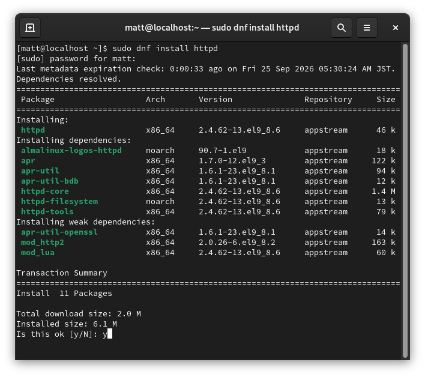
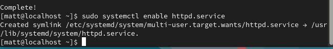
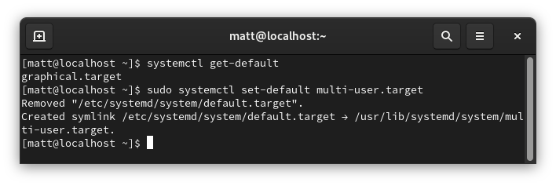
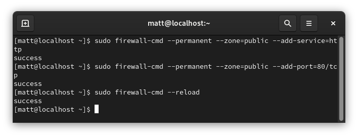
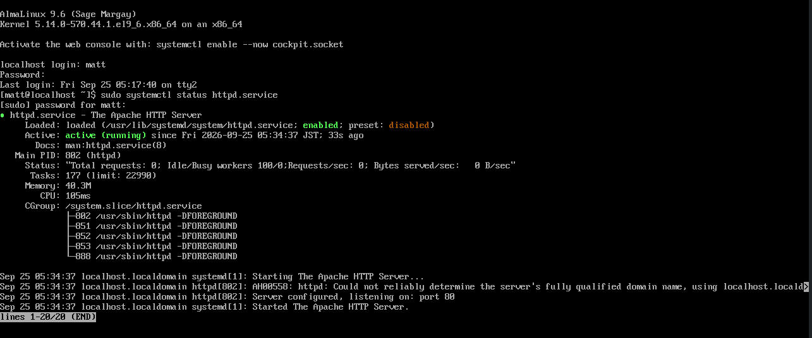
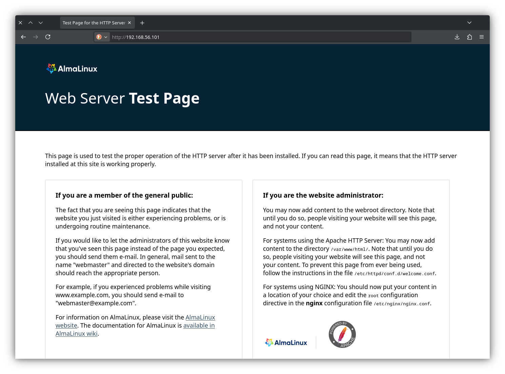

Manage services (systemctl start/stop/enable/disable), boot targets, and runlevels; include snapshots or outputs

1. Install httpd

2. Enable httpd

3. Set Default Run Target

4. Open Firewall

5. httpd is enabled and running n the multi-user target/runlevel 3

6. Running webpage on my host machine through a host-only interface

