This is to demonstrate my ability in partitioning and LVM

Here is the setup I started with. I attached 3-20GB drives to my virtual machine. The plan is to split sdb in half and mount sdb1 to a backup directory for my matt user and sdb2 will be combined in a logical volume with sdc and sdd mounted to a shared folder at /home/shared.

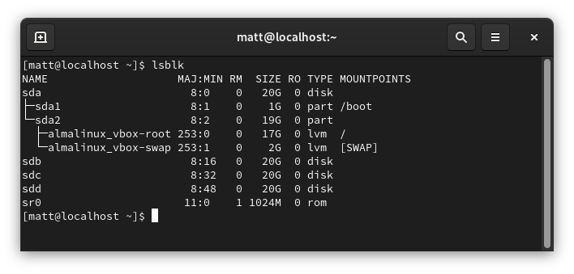

Here I created two 10GiB partitions or at least close to it.
Note: Please ignore the warning, I will format it again later.
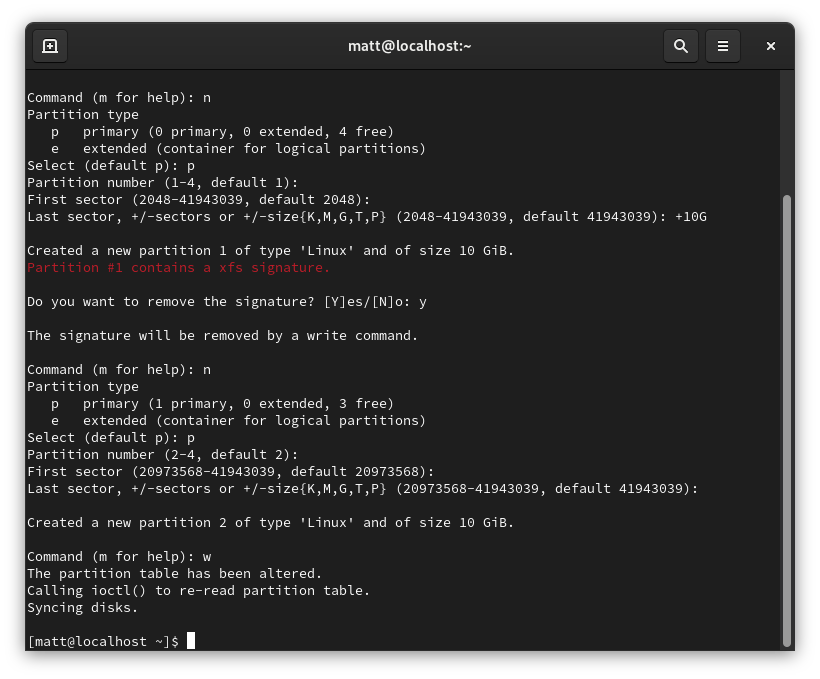

Drive sdb is now split into two partitions of near equal size.
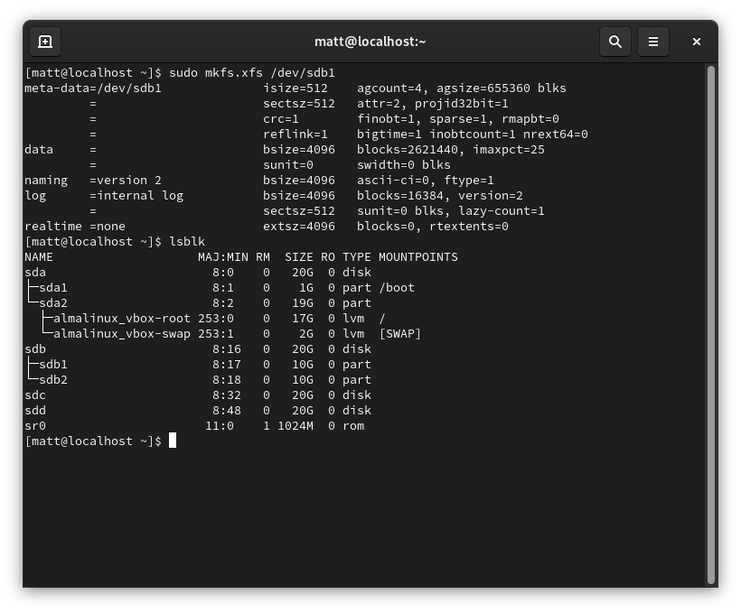

I added the drive to fstab so it will automount on boot. I used the UUID instead of the drive path. It is more reliable. Then I updated systemd units with a systemctl daemon-reload command and mounted the drives from fstab using mount -a.
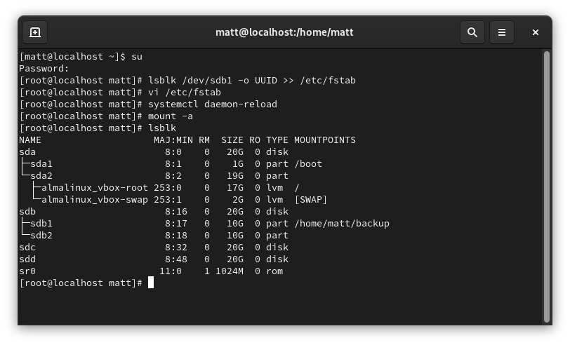

Here is the result.
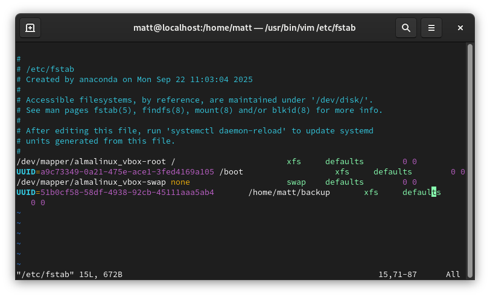

Next I will create the logical volume. Here I assign devices sdb2, sdc, and sdd as physical volumes for lvm. I believe I was too hasty in the earlier fdisk step but nevertheless the pvcreate command finished without issue.
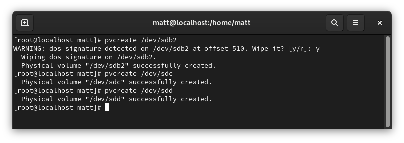

Here is the result
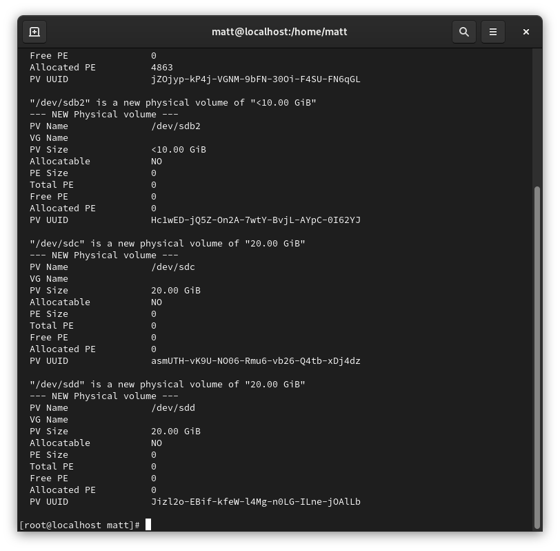

Next I created the volume group "ThreeDrives" and added the previous drives to it.
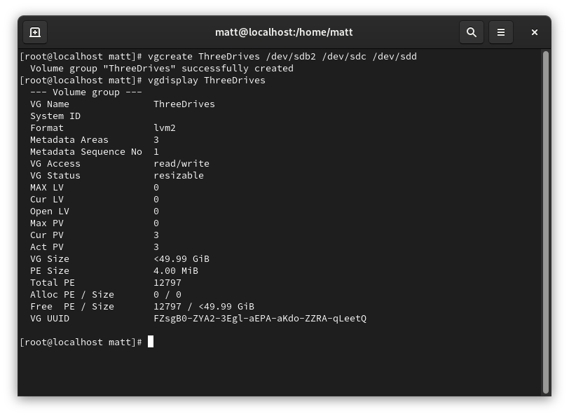

I then used this volume group to carve up a 48GB logical volume named shared-lv. I did 48GB instead of 50GB due to my earlier issue in calculation between GB and GiB so that there would be some breathing room.
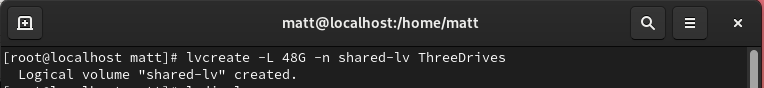

Here is the result.
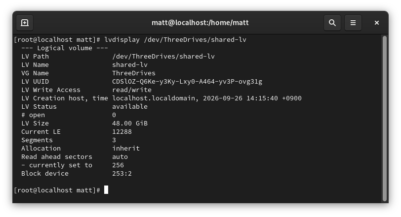

Here are the block devices again. Next we need to create the filesystem and mount the logical volume so that it is useable.
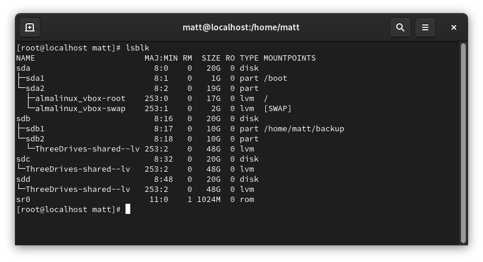

Making the filesystem.
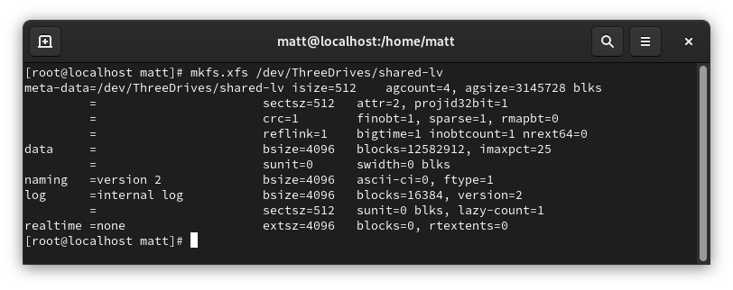

New fstab entry for the logical volume. 
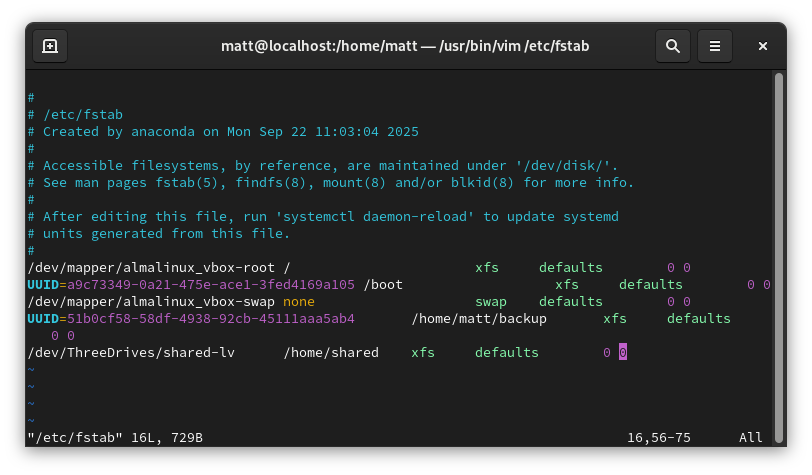

Finally, I did another systemctl daemon-reload and mount -a to confirm fstab has no issues and to mount the new logical volume. 
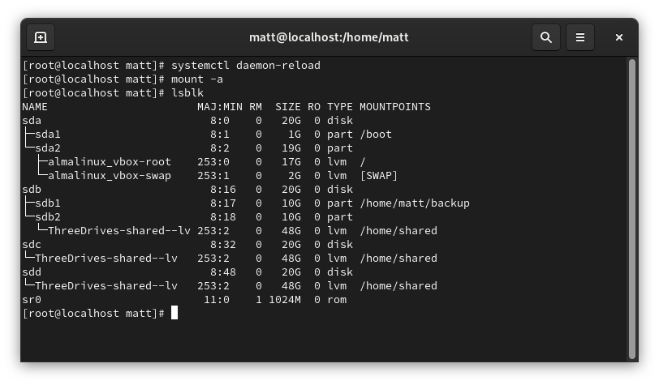
