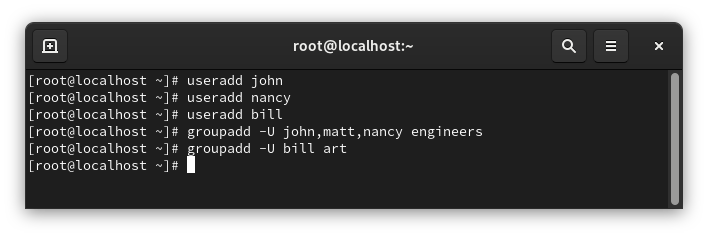
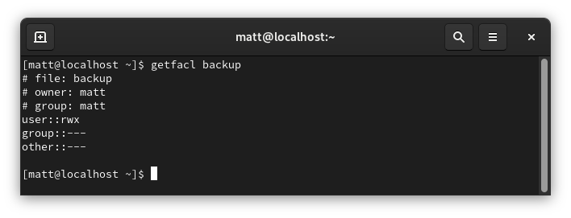
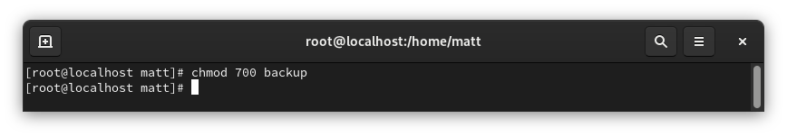
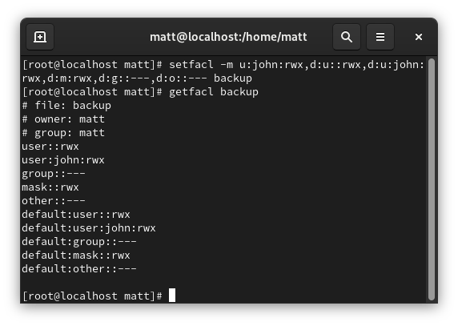
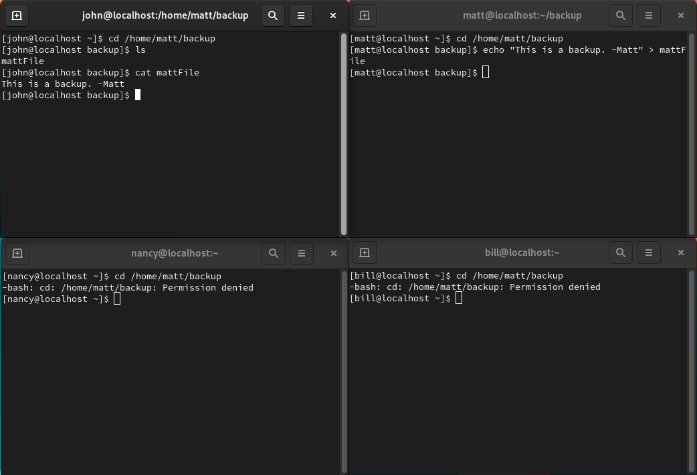
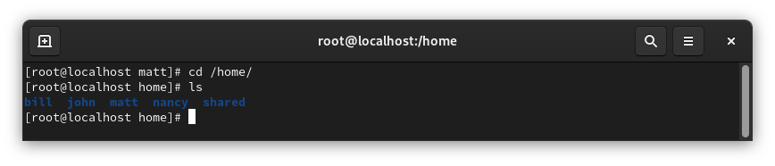
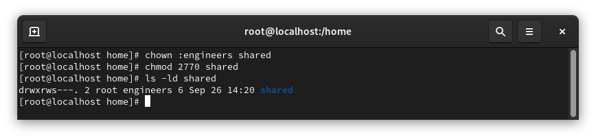
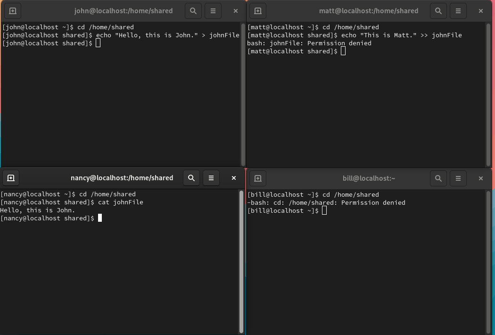

I am continuing from my previous exercise, 03 - Configure Local Storage. Please reference it for partitioning and LVM setup. 
We have 4 employees at our company. John - Engineer lead, Matt and Nancy - engineers, Bill - art director
John wants access to Matt*s backup folder and the engineers need access to the shared /home/shared directory

First I make the users and groups. Matt already exists and I set the passwords later.

Let's start with our ACL for the /home/matt/backup directory. I give access to the owner(matt) and john and no one else. For this configuration I also had to give others permission to execute the /home/matt directory. 

Here is our original getfacl output.

I set the permissions to only the owner due to the backup's secret nature.

Here we set the ACL permissions and defaults for the backup directory. 

Here as we can see John and Matt can access the directory. 

Next, let's set up the shared directory only for the engineers. 

I set group ownership to the engineers group and set permissions to 770 with the gid option so that anything created in the folder will inherit that group ownership.

Here as you can see all the engineers: John, Matt, and Nancy, can access the directory but Bill in the art department cannot.

