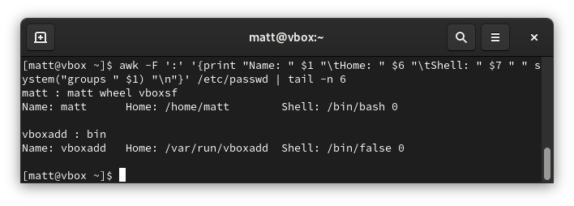
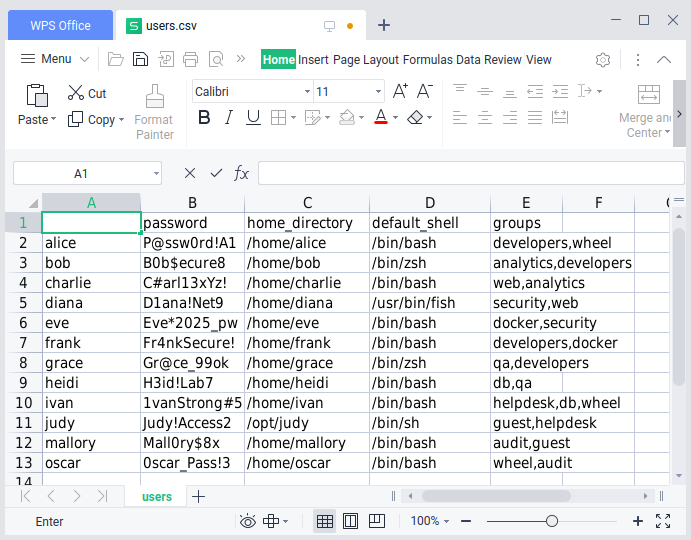
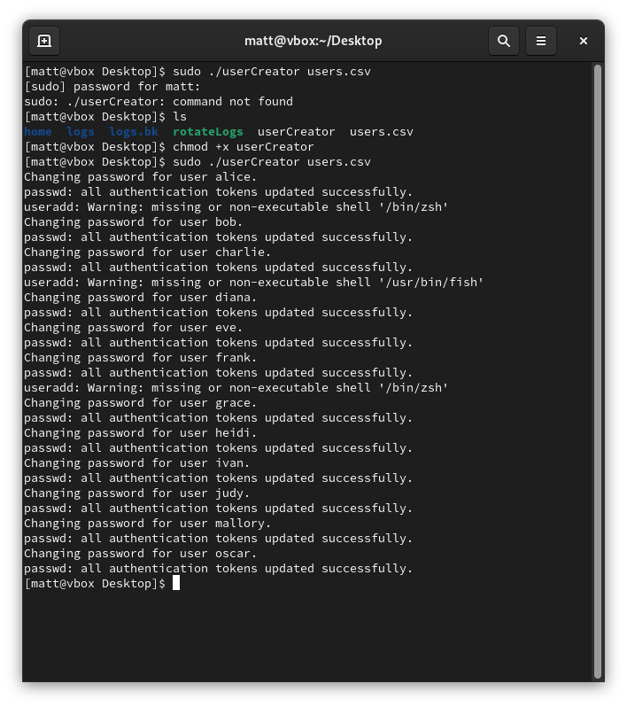
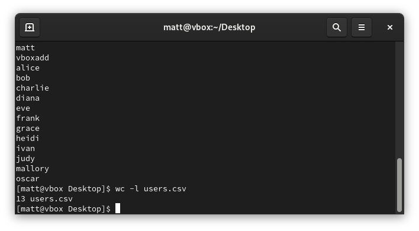

Scripts for creating/deleting users, managing groups, setting passwords, default shells, home directories; can handle bulk via CSV

### User list before adding users.csv

### users.csv

### Script Output

### User list after addings users.csv
###### wc -l users.csv includes the header row

